# 영화 리뷰 데이터베이스 프로젝트

## 1. 프로젝트 개요

이 프로젝트는 영화, 장르, 사용자, 리뷰 정보를 관계형 데이터베이스로 관리하기 위한 MySQL 기반 데이터베이스 설계 및 SQL 실습 프로젝트이다.
기존 엑셀처럼 하나의 표에 모든 정보를 저장하는 방식이 아니라, 데이터의 성격에 따라 `genres`, `users`, `movies`, `reviews` 4개의 테이블로 분리하였다. 이를 통해 중복 데이터를 줄이고, PK와 FK를 사용하여 데이터 사이의 관계를 명확하게 연결할 수 있도록 구성하였다.

본 데이터베이스의 핵심 도메인은 다음과 같다.

* 하나의 장르에는 여러 영화가 속할 수 있다. `genres 1 : N movies`
* 하나의 영화에는 여러 리뷰가 작성될 수 있다. `movies 1 : N reviews`
* 하나의 사용자는 여러 리뷰를 작성할 수 있다. `users 1 : N reviews`

즉, 영화 리뷰 서비스에서 필요한 기본 정보인 장르, 영화, 사용자, 리뷰를 각각 독립적인 테이블로 나누고, 외래키를 통해 실제 서비스에서 사용되는 관계를 표현하였다.

---

## 2. 파일 구성

```text
cody_sql/
├── README.md
├── schema.sql      # 데이터베이스 및 테이블 생성 코드
├── data.sql        # 각 테이블에 삽입할 샘플 데이터
├── queries.sql     # 평가 조건을 만족하는 15개 SQL 쿼리
└── screenshots/    # 각 쿼리 실행 결과 스크린샷
    ├── q1.png
    ├── q2.png
    ├── ...
    └── q15.png
```

실행 순서는 다음과 같다.

```sql
SOURCE schema.sql;
SOURCE data.sql;
SOURCE queries.sql;
```

단, `queries.sql`에는 `UPDATE`, `DELETE` 쿼리가 포함되어 있으므로 같은 데이터 상태에서 다시 확인하려면 `schema.sql`과 `data.sql`을 다시 실행한 뒤 쿼리를 실행하는 것이 좋다.

---

## 3. 데이터베이스 전체 구조 설명

### 3.1 테이블 관계 요약

| 테이블       | 역할                | 주요 PK | 주요 FK                                          |
| --------- | ----------------- | ----- | ---------------------------------------------- |
| `genres`  | 영화 장르 정보 저장       | `id`  | 없음                                             |
| `users`   | 리뷰 작성 사용자 정보 저장   | `id`  | 없음                                             |
| `movies`  | 영화 기본 정보 저장       | `id`  | `genre_id → genres(id)`                        |
| `reviews` | 사용자가 영화에 남긴 리뷰 저장 | `id`  | `movie_id → movies(id)`, `user_id → users(id)` |

### 3.2 ERD 형태의 관계

```text
genres
  1 ─────── N
            movies
              1 ─────── N
                          reviews
                          N ─────── 1
                                      users
```

* `genres.id`는 `movies.genre_id`와 연결된다.
* `movies.id`는 `reviews.movie_id`와 연결된다.
* `users.id`는 `reviews.user_id`와 연결된다.
* 따라서 리뷰 한 개는 반드시 하나의 영화와 하나의 사용자에 연결된다.

---

## 4. 평가기준별 보완 설명 및 증빙

## 평가기준 1. 최소 4개 테이블 존재 및 PK 정의 여부

본 프로젝트는 `genres`, `users`, `movies`, `reviews` 총 4개의 테이블을 사용한다. 각 테이블에는 `id INT AUTO_INCREMENT PRIMARY KEY`가 정의되어 있어 각 행을 고유하게 식별할 수 있다.

관련 코드 위치: `schema.sql`

```sql
CREATE TABLE genres (
    id INT AUTO_INCREMENT PRIMARY KEY,
    name VARCHAR(50) NOT NULL UNIQUE
);

CREATE TABLE users (
    id INT AUTO_INCREMENT PRIMARY KEY,
    email VARCHAR(100) NOT NULL UNIQUE,
    name VARCHAR(50) NOT NULL,
    created_at DATETIME DEFAULT CURRENT_TIMESTAMP
);

CREATE TABLE movies (
    id INT AUTO_INCREMENT PRIMARY KEY,
    title VARCHAR(100) NOT NULL,
    genre_id INT NOT NULL,
    release_date DATE NOT NULL,
    duration INT NOT NULL,
    FOREIGN KEY (genre_id) REFERENCES genres(id)
);

CREATE TABLE reviews (
    id INT AUTO_INCREMENT PRIMARY KEY,
    movie_id INT NOT NULL,
    user_id INT NOT NULL,
    rating INT NOT NULL,
    content TEXT,
    created_at DATETIME DEFAULT CURRENT_TIMESTAMP,
    FOREIGN KEY (movie_id) REFERENCES movies(id) ON DELETE CASCADE,
    FOREIGN KEY (user_id) REFERENCES users(id) ON DELETE CASCADE
);
```

---

## 평가기준 2. FK를 사용한 1:N 관계 및 제약 조건 동작

본 데이터베이스는 외래키를 사용하여 다음과 같은 1:N 관계를 표현한다.

1. `genres 1 : N movies`
   하나의 장르는 여러 영화를 가질 수 있다. 예를 들어 `SF` 장르에는 `인셉션`, `아바타: 물의 길`, `인터스텔라`가 연결된다.

2. `movies 1 : N reviews`
   하나의 영화에는 여러 리뷰가 작성될 수 있다. 예를 들어 `인셉션`에는 여러 사용자의 리뷰가 연결될 수 있다.

3. `users 1 : N reviews`
   하나의 사용자는 여러 리뷰를 작성할 수 있다.

관련 코드:

```sql
FOREIGN KEY (genre_id) REFERENCES genres(id)
```

```sql
FOREIGN KEY (movie_id) REFERENCES movies(id) ON DELETE CASCADE,
FOREIGN KEY (user_id) REFERENCES users(id) ON DELETE CASCADE
```

외래키 제약 조건 때문에 `movies.genre_id`에는 `genres.id`에 존재하는 값만 들어갈 수 있고, `reviews.movie_id`, `reviews.user_id`에도 각각 존재하는 영화와 사용자 ID만 들어갈 수 있다. 따라서 잘못된 참조 데이터가 들어가는 것을 방지할 수 있다.

---

## 평가기준 3. 각 테이블에 최소 10행 이상의 샘플 데이터 입력

`data.sql`에서는 4개 테이블에 각각 10개씩 샘플 데이터를 삽입하였다.

| 테이블       | 샘플 데이터 수 | 예시                     |
| --------- | -------: | ---------------------- |
| `genres`  |      10행 | 액션, 코미디, 드라마, SF, 공포 등 |
| `users`   |      10행 | 김철수, 이영희, 박민수 등        |
| `movies`  |      10행 | 인셉션, 기생충, 인터스텔라 등      |
| `reviews` |      10행 | 영화별 사용자 리뷰 및 평점        |

확인용 쿼리:

```sql
SELECT COUNT(*) AS genre_count FROM genres;
SELECT COUNT(*) AS user_count FROM users;
SELECT COUNT(*) AS movie_count FROM movies;
SELECT COUNT(*) AS review_count FROM reviews;
```

---

## 평가기준 4. 조건을 포함한 15개 SQL 쿼리 작성

`queries.sql`에는 기본 조회, 조인, 집계, 서브쿼리, 수정, 삭제, 인덱스를 포함한 15개 쿼리를 작성하였다.

| 번호 | 쿼리 유형                  | 설명                    |
| -: | ---------------------- | --------------------- |
|  1 | 기본 조회 / WHERE          | 상영 시간이 130분 이상인 영화 조회 |
|  2 | ORDER BY               | 최근 가입 사용자 순 정렬        |
|  3 | ORDER BY / LIMIT       | 상영 시간이 긴 영화 Top 3 조회  |
|  4 | LIKE / WHERE           | gmail 사용자를 이름순 조회     |
|  5 | INNER JOIN             | 영화와 장르 연결 조회          |
|  6 | INNER JOIN             | 리뷰와 사용자 연결 조회         |
|  7 | LEFT JOIN              | 리뷰가 없는 영화도 포함하여 조회    |
|  8 | 다중 JOIN                | 영화, 장르, 사용자, 리뷰 통합 조회 |
|  9 | GROUP BY / COUNT       | 장르별 영화 수 집계           |
| 10 | GROUP BY / AVG         | 영화별 평균 평점 계산          |
| 11 | GROUP BY / SUM / COUNT | 사용자별 총 평점과 리뷰 수 집계    |
| 12 | 서브쿼리                   | 평균 상영 시간보다 긴 영화 조회    |
| 13 | UPDATE                 | 사용자 이름 수정             |
| 14 | DELETE                 | 평점 3점 이하 리뷰 삭제        |
| 15 | INDEX                  | 영화 제목 컬럼에 인덱스 생성      |

---

## 평가기준 5. 각 쿼리 실행 결과 스크린샷 첨부

각 쿼리의 실행 결과는 `screenshots` 폴더에 `q1.png`부터 `q15.png`까지 저장하였다.

### Query 1. 상영 시간이 130분 이상인 영화 목록 조회

```sql
SELECT id, title, duration
FROM movies
WHERE duration >= 130;
```

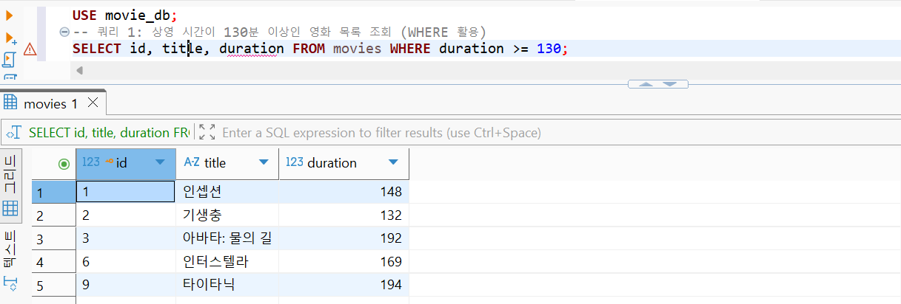

### Query 2. 회원 가입일이 가장 최근인 순서로 사용자 조회

```sql
SELECT id, email, name, created_at
FROM users
ORDER BY created_at DESC;
```

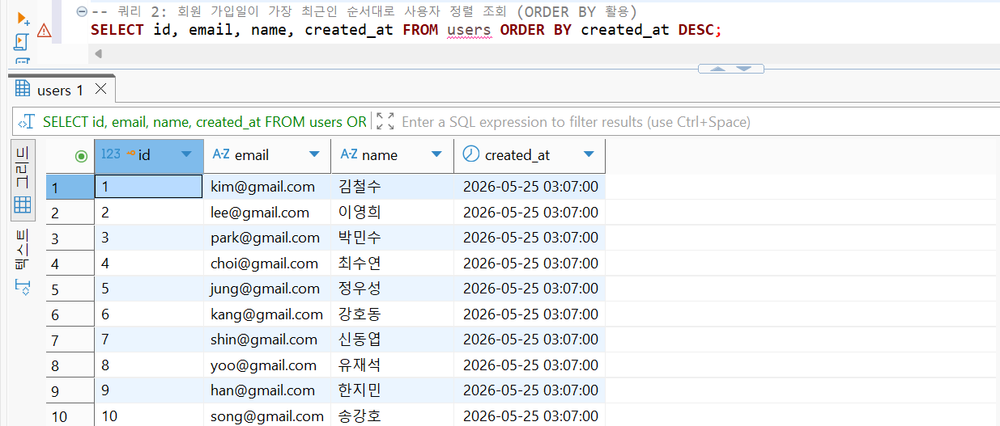

### Query 3. 상영 시간이 가장 긴 영화 Top 3 조회

```sql
SELECT title, duration
FROM movies
ORDER BY duration DESC
LIMIT 3;
```

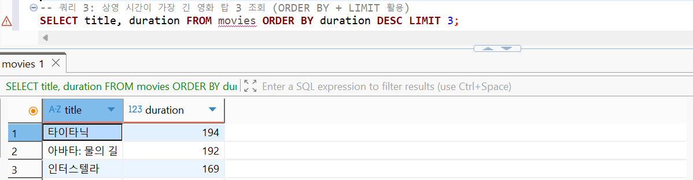

### Query 4. 이메일 주소에 gmail이 포함된 사용자 조회

```sql
SELECT id, email, name
FROM users
WHERE email LIKE '%gmail%'
ORDER BY name ASC;
```

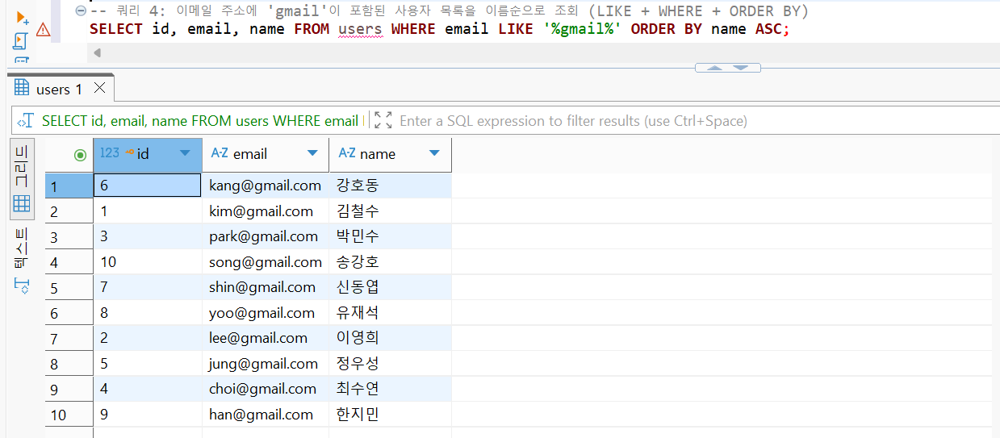

### Query 5. 영화 제목과 장르명 조회

```sql
SELECT m.id, m.title, g.name AS genre_name
FROM movies m
INNER JOIN genres g ON m.genre_id = g.id;
```

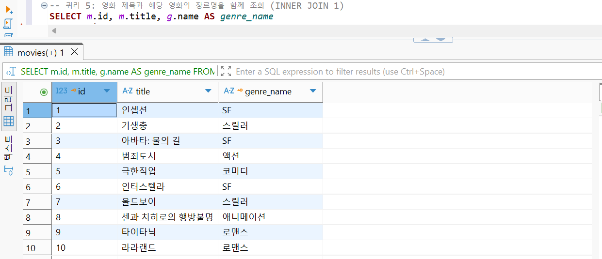

### Query 6. 리뷰 내용과 작성자 이름 조회

```sql
SELECT r.id, u.name AS user_name, r.content, r.rating
FROM reviews r
INNER JOIN users u ON r.user_id = u.id;
```

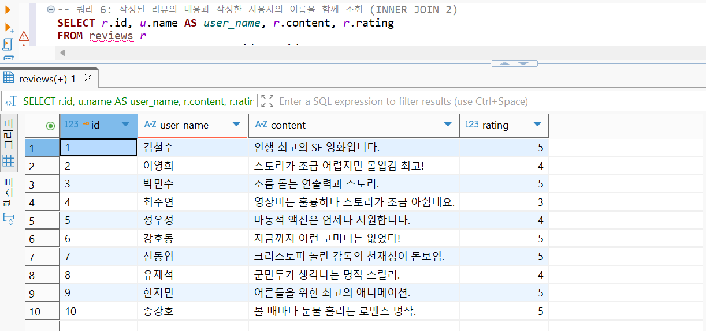

### Query 7. 전체 영화 목록과 리뷰 정보 조회

```sql
SELECT m.title, r.rating, r.content
FROM movies m
LEFT JOIN reviews r ON m.id = r.movie_id;
```

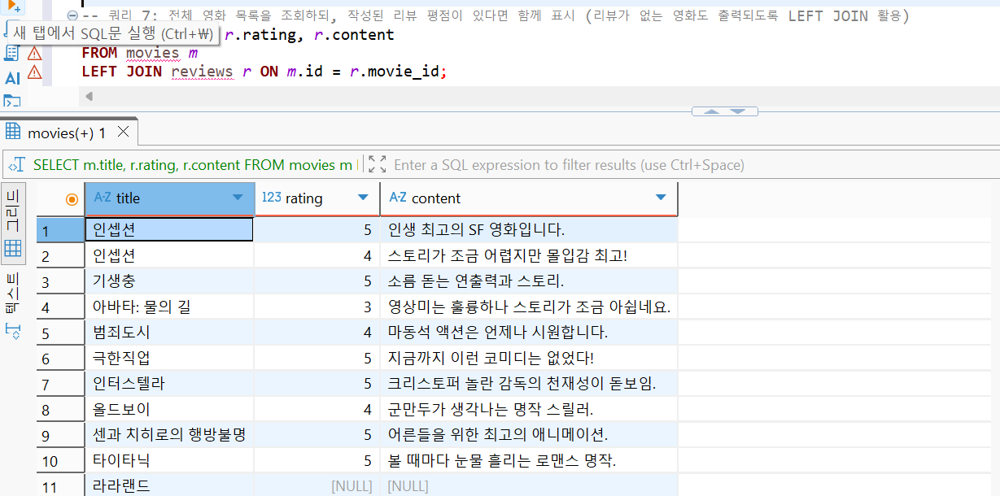

### Query 8. 영화, 장르, 사용자, 리뷰를 한 번에 조회

```sql
SELECT
    m.title AS movie_title,
    g.name AS genre_name,
    u.name AS user_name,
    r.content
FROM reviews r
INNER JOIN movies m ON r.movie_id = m.id
INNER JOIN genres g ON m.genre_id = g.id
INNER JOIN users u ON r.user_id = u.id;
```

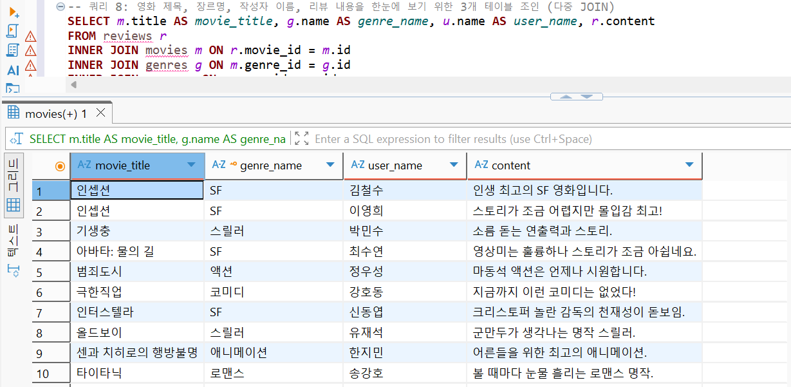

### Query 9. 장르별 영화 개수 집계

```sql
SELECT g.name AS genre_name, COUNT(m.id) AS movie_count
FROM genres g
LEFT JOIN movies m ON g.id = m.genre_id
GROUP BY g.id, g.name;
```

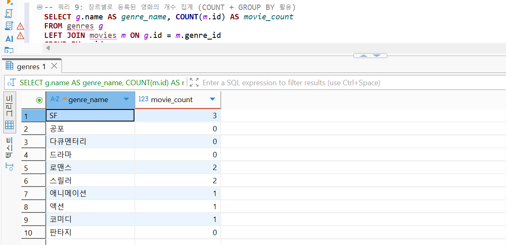

### Query 10. 영화별 평균 리뷰 평점 계산

```sql
SELECT m.title, AVG(r.rating) AS average_rating
FROM movies m
INNER JOIN reviews r ON m.id = r.movie_id
GROUP BY m.id, m.title;
```

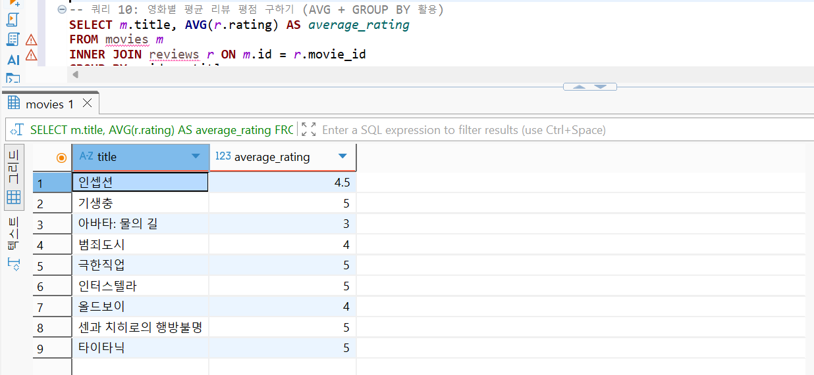

### Query 11. 사용자별 총 평점 점수와 리뷰 수 집계

```sql
SELECT
    u.name,
    SUM(r.rating) AS total_rating_points,
    COUNT(r.id) AS review_count
FROM users u
INNER JOIN reviews r ON u.id = r.user_id
GROUP BY u.id, u.name;
```

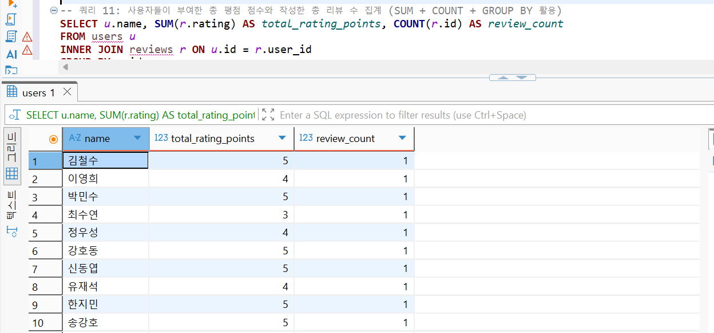

### Query 12. 전체 평균 상영 시간보다 긴 영화 조회

```sql
SELECT title, duration
FROM movies
WHERE duration > (SELECT AVG(duration) FROM movies);
```

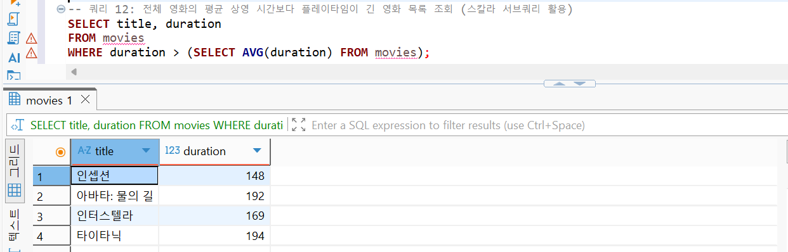

### Query 13. 사용자 이름 수정

```sql
UPDATE users
SET name = '김대박'
WHERE id = 1;
```

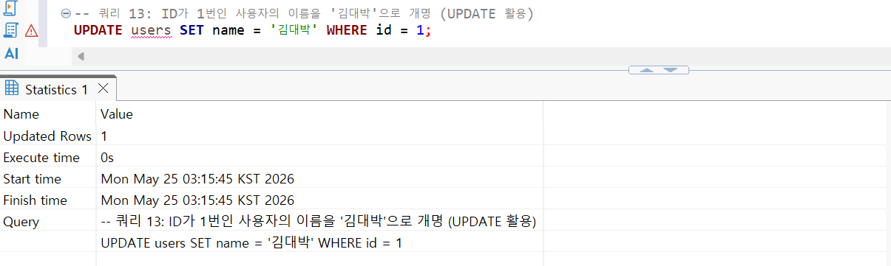

### Query 14. 평점 3점 이하 리뷰 삭제

```sql
DELETE FROM reviews
WHERE rating <= 3;
```

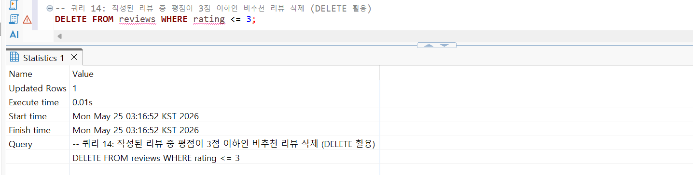

### Query 15. 영화 제목 컬럼 인덱스 생성

```sql
CREATE INDEX idx_movie_title
ON movies(title);
```

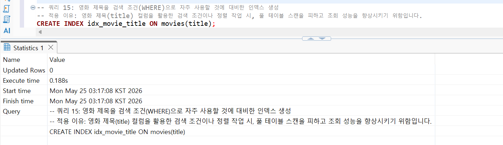

---

## 평가기준 6. 테이블 분리 이유와 각 테이블 역할

하나의 엑셀 표처럼 모든 데이터를 한 테이블에 저장하면 같은 장르명, 같은 사용자 정보, 같은 영화 정보가 여러 행에 반복 저장된다. 예를 들어 한 영화에 리뷰가 100개 있으면 영화 제목과 장르명이 100번 반복될 수 있다. 이러한 구조는 중복이 많고, 수정 시 불일치가 발생하기 쉽다.

따라서 본 프로젝트에서는 데이터를 다음과 같이 분리하였다.

| 테이블       | 분리 이유                                        |
| --------- | -------------------------------------------- |
| `genres`  | 장르명을 한 번만 저장하고 여러 영화가 참조하도록 하기 위해 분리         |
| `users`   | 사용자 정보를 리뷰와 분리하여 사용자 정보 변경 시 한 곳만 수정하기 위해 분리 |
| `movies`  | 영화의 기본 정보를 리뷰와 분리하여 영화 정보 중복을 줄이기 위해 분리      |
| `reviews` | 사용자가 영화에 남긴 평가 정보를 별도로 저장하기 위해 분리            |

이렇게 테이블을 분리하면 데이터 중복이 줄어들고, PK와 FK를 통해 데이터 사이의 관계를 안정적으로 관리할 수 있다.

---

## 평가기준 7. FK로 연결한 1:N 관계의 도메인 의미

본 데이터베이스의 FK 관계는 영화 리뷰 서비스의 실제 도메인 관계를 반영한다.

### 장르와 영화의 1:N 관계

하나의 장르는 여러 영화에 적용될 수 있다. 예를 들어 `SF` 장르는 `인셉션`, `아바타: 물의 길`, `인터스텔라`와 연결된다. 이를 표현하기 위해 `movies.genre_id`가 `genres.id`를 참조한다.

```text
genres.id = 4  →  movies.genre_id = 4
SF             →  인셉션, 아바타: 물의 길, 인터스텔라
```

### 영화와 리뷰의 1:N 관계

하나의 영화에는 여러 사용자가 리뷰를 작성할 수 있다. 예를 들어 `인셉션`에는 김철수와 이영희가 각각 리뷰를 남길 수 있다. 이를 표현하기 위해 `reviews.movie_id`가 `movies.id`를 참조한다.

### 사용자와 리뷰의 1:N 관계

하나의 사용자는 여러 영화에 리뷰를 작성할 수 있다. 이를 표현하기 위해 `reviews.user_id`가 `users.id`를 참조한다.

---

## 평가기준 8. 컬럼 타입 선택 이유

| 테이블       | 컬럼             | 타입                   | 선택 이유                                |
| --------- | -------------- | -------------------- | ------------------------------------ |
| 공통        | `id`           | `INT AUTO_INCREMENT` | 각 행을 숫자로 고유하게 식별하고 자동 증가시키기 위해 사용    |
| `genres`  | `name`         | `VARCHAR(50)`        | 장르명은 짧은 문자열이므로 가변 길이 문자열 사용          |
| `users`   | `email`        | `VARCHAR(100)`       | 이메일 주소는 문자열이며 길이가 사용자마다 다르므로 사용      |
| `users`   | `name`         | `VARCHAR(50)`        | 사용자 이름은 짧은 문자열이므로 사용                 |
| `users`   | `created_at`   | `DATETIME`           | 가입 시점처럼 날짜와 시간이 모두 필요한 값을 저장하기 위해 사용 |
| `movies`  | `title`        | `VARCHAR(100)`       | 영화 제목은 문자열이며 길이가 다양하므로 사용            |
| `movies`  | `release_date` | `DATE`               | 개봉일은 시간 없이 날짜만 필요하므로 사용              |
| `movies`  | `duration`     | `INT`                | 상영 시간은 분 단위 정수로 관리할 수 있으므로 사용        |
| `reviews` | `rating`       | `INT`                | 평점은 1~5점의 정수 값으로 저장하기 위해 사용          |
| `reviews` | `content`      | `TEXT`               | 리뷰 내용은 길이가 길어질 수 있으므로 `TEXT` 사용      |
| `reviews` | `created_at`   | `DATETIME`           | 리뷰 작성 시각을 저장하기 위해 사용                 |

---

## 평가기준 9. 인덱스 적용 컬럼 및 이유

본 프로젝트에서는 `movies.title` 컬럼에 인덱스를 적용하였다.

```sql
CREATE INDEX idx_movie_title
ON movies(title);
```

영화 리뷰 서비스에서는 사용자가 영화 제목으로 검색하는 경우가 많다. 예를 들어 `WHERE title = '인셉션'` 또는 `WHERE title LIKE '%인셉션%'`과 같은 검색이 자주 발생할 수 있다. 따라서 `movies.title`에 인덱스를 생성하면 영화 제목을 기준으로 검색하거나 정렬할 때 전체 테이블을 처음부터 끝까지 확인하는 비용을 줄일 수 있다.

실행 결과 증빙:


---

## 평가기준 10. 데이터베이스와 엑셀의 차이점 및 테이블 분리 저장 이유

엑셀은 작은 규모의 데이터를 사람이 직접 보고 수정하기에는 편리하지만, 데이터가 많아지고 관계가 복잡해지면 중복과 오류가 발생하기 쉽다. 반면 데이터베이스는 데이터를 여러 테이블로 분리하고, PK와 FK를 통해 관계를 정의하여 데이터의 무결성을 유지할 수 있다.

| 구분      | 엑셀                       | 데이터베이스               |
| ------- | ------------------------ | -------------------- |
| 데이터 구조  | 하나의 시트에 모든 정보를 넣는 경우가 많음 | 여러 테이블로 분리하여 저장      |
| 관계 표현   | 셀 값으로 수동 관리              | PK/FK로 명확하게 연결       |
| 중복 관리   | 같은 값이 여러 번 반복되기 쉬움       | 정규화를 통해 중복 최소화       |
| 데이터 무결성 | 잘못된 값 입력을 막기 어려움         | 제약 조건으로 잘못된 참조 방지    |
| 조회 기능   | 필터 중심                    | SQL로 조인, 집계, 서브쿼리 가능 |
| 확장성     | 데이터가 커지면 관리 어려움          | 대용량 데이터 관리에 적합       |

예를 들어 엑셀에서 영화 리뷰 정보를 한 시트에 저장하면 `인셉션`, `SF`, `김철수` 같은 값이 리뷰마다 반복될 수 있다. 하지만 본 데이터베이스에서는 영화 정보는 `movies`, 장르 정보는 `genres`, 사용자 정보는 `users`, 리뷰 정보는 `reviews`에 분리하여 저장한다. 리뷰 테이블은 필요한 ID만 참조하므로 중복을 줄이고 데이터 수정도 쉬워진다.

---

## 평가기준 11. PK와 FK의 역할, 1:N 데이터 연결 방식 설명

### PK의 역할

PK는 각 테이블에서 하나의 행을 고유하게 식별하는 값이다. 예를 들어 `movies.id = 1`은 `인셉션`이라는 영화를 고유하게 나타낸다. 영화 제목은 중복 가능성이 있지만, `id`는 중복되지 않기 때문에 안정적인 식별자로 사용할 수 있다.

### FK의 역할

FK는 한 테이블의 데이터가 다른 테이블의 PK를 참조하도록 만드는 값이다. 예를 들어 `reviews.movie_id = 1`은 해당 리뷰가 `movies.id = 1`인 영화, 즉 `인셉션`에 대한 리뷰임을 의미한다.

### 1:N 연결 방식 예시

```text
movies 테이블
id | title
1  | 인셉션

reviews 테이블
id | movie_id | user_id | rating | content
1  | 1        | 1       | 5      | 인생 최고의 SF 영화입니다.
2  | 1        | 2       | 4      | 스토리가 조금 어렵지만 몰입감 최고!
```

위 예시에서 `movies.id = 1`인 영화 하나에 대해 `reviews.movie_id = 1`인 리뷰가 여러 개 존재할 수 있다. 이것이 영화와 리뷰 사이의 1:N 관계이다.

---

## 평가기준 12. INNER JOIN과 LEFT JOIN의 차이

### INNER JOIN

`INNER JOIN`은 양쪽 테이블에서 연결 조건이 일치하는 데이터만 출력한다.

```sql
SELECT m.id, m.title, g.name AS genre_name
FROM movies m
INNER JOIN genres g ON m.genre_id = g.id;
```

실행 결과:


### LEFT JOIN

`LEFT JOIN`은 왼쪽 테이블의 데이터는 모두 출력하고, 오른쪽 테이블에 연결되는 데이터가 없으면 `NULL`로 표시한다.

```sql
SELECT m.title, r.rating, r.content
FROM movies m
LEFT JOIN reviews r ON m.id = r.movie_id;
```

실행 결과:


이 프로젝트에서는 전체 영화 목록을 기준으로 리뷰 정보를 붙이기 위해 `LEFT JOIN`을 사용하였다. 리뷰가 없는 영화도 영화 목록에는 존재해야 하므로, `movies`를 왼쪽 테이블로 두고 `reviews`를 붙였다. 즉, `INNER JOIN`을 사용하면 리뷰가 없는 영화는 결과에서 제외되지만, `LEFT JOIN`을 사용하면 리뷰가 없는 영화도 결과에 남고 리뷰 컬럼만 `NULL`로 표시된다.

---

## 평가기준 13. GROUP BY와 집계 함수의 동작 원리

`GROUP BY`는 같은 값을 가진 행들을 하나의 그룹으로 묶고, `COUNT`, `AVG`, `SUM` 같은 집계 함수를 사용하여 그룹별 결과를 계산한다.

### 장르별 영화 수 집계

```sql
SELECT g.name AS genre_name, COUNT(m.id) AS movie_count
FROM genres g
LEFT JOIN movies m ON g.id = m.genre_id
GROUP BY g.id, g.name;
```

실행 결과:


위 쿼리는 장르별로 영화를 묶은 뒤, 각 장르에 속한 영화 수를 `COUNT(m.id)`로 계산한다.

### 영화별 평균 평점 계산

```sql
SELECT m.title, AVG(r.rating) AS average_rating
FROM movies m
INNER JOIN reviews r ON m.id = r.movie_id
GROUP BY m.id, m.title;
```

실행 결과:


위 쿼리는 영화별로 리뷰를 묶은 뒤, 각 영화에 달린 리뷰 평점의 평균을 `AVG(r.rating)`으로 계산한다.

---

## 평가기준 14. 가장 복잡했던 쿼리와 해결 과정

가장 복잡했던 쿼리는 Query 8의 다중 JOIN 쿼리이다.

```sql
SELECT
    m.title AS movie_title,
    g.name AS genre_name,
    u.name AS user_name,
    r.content
FROM reviews r
INNER JOIN movies m ON r.movie_id = m.id
INNER JOIN genres g ON m.genre_id = g.id
INNER JOIN users u ON r.user_id = u.id;
```

실행 결과:


### 해결 과정

1. 먼저 기준 테이블을 `reviews`로 정했다. 최종적으로 보고 싶은 정보가 리뷰 내용이므로, 리뷰 테이블을 중심에 두었다.
2. 리뷰가 어떤 영화에 작성된 것인지 확인하기 위해 `reviews.movie_id = movies.id` 조건으로 `movies` 테이블을 조인했다.
3. 영화의 장르명을 가져오기 위해 `movies.genre_id = genres.id` 조건으로 `genres` 테이블을 추가로 조인했다.
4. 리뷰 작성자 이름을 가져오기 위해 `reviews.user_id = users.id` 조건으로 `users` 테이블을 조인했다.
5. 마지막으로 출력 컬럼을 `영화 제목`, `장르명`, `작성자 이름`, `리뷰 내용`으로 정리하여 사람이 읽기 쉬운 결과를 만들었다.

이 쿼리는 4개의 테이블을 동시에 연결해야 했기 때문에 가장 복잡했다. 하지만 FK 관계를 기준으로 하나씩 연결하니 전체 구조를 이해하기 쉬웠다.

---

## 평가기준 15. 미션 수행 중 어려웠던 부분과 해결 방법

이번 미션에서 가장 어려웠던 부분은 테이블을 어떻게 나누고, 어떤 컬럼을 FK로 연결해야 하는지 결정하는 것이었다. 처음에는 영화 제목, 장르명, 사용자 이름, 리뷰 내용을 하나의 테이블에 모두 넣는 방식도 가능하다고 생각했다. 하지만 그렇게 하면 같은 영화 제목과 장르명이 리뷰 수만큼 반복되고, 사용자 정보도 여러 번 중복 저장되는 문제가 생긴다.

이를 해결하기 위해 데이터를 성격별로 분리하였다. 장르는 `genres`, 사용자는 `users`, 영화는 `movies`, 리뷰는 `reviews`에 저장하도록 나누었다. 이후 `movies.genre_id`, `reviews.movie_id`, `reviews.user_id`를 FK로 설정하여 분리된 테이블들이 다시 연결될 수 있도록 설계하였다.

또 하나 어려웠던 부분은 `INNER JOIN`과 `LEFT JOIN`의 차이를 이해하는 것이었다. `INNER JOIN`은 연결되는 데이터만 보여주지만, `LEFT JOIN`은 왼쪽 테이블의 데이터는 모두 보여준다는 차이가 있었다. 본 프로젝트에서는 리뷰가 없는 영화도 확인하기 위해 Query 7에서 `LEFT JOIN`을 사용하였다.

마지막으로 `GROUP BY`는 단순 조회와 달리 데이터를 그룹 단위로 묶은 뒤 계산하는 방식이라 처음에는 헷갈렸다. 장르별 영화 수, 영화별 평균 평점처럼 “무엇을 기준으로 묶을지”를 먼저 정하고, 그다음 `COUNT`, `AVG`, `SUM` 같은 집계 함수를 적용하니 쿼리를 이해하기 쉬웠다.

---

## 최종 정리

본 프로젝트는 영화 리뷰 서비스를 예시로 하여 관계형 데이터베이스의 핵심 개념을 구현하였다. 4개의 테이블을 만들고 각 테이블에 PK를 설정했으며, FK를 통해 장르-영화, 영화-리뷰, 사용자-리뷰의 1:N 관계를 표현하였다. 또한 각 테이블에 10개 이상의 샘플 데이터를 입력하고, 기본 조회, 조인, 집계, 서브쿼리, 수정, 삭제, 인덱스 생성까지 포함한 15개의 SQL 쿼리를 작성하였다.

이를 통해 단순히 데이터를 저장하는 것뿐만 아니라, 테이블을 분리하는 이유, PK/FK의 역할, JOIN과 GROUP BY의 동작 방식, 인덱스 적용 이유까지 함께 확인할 수 있었다.
